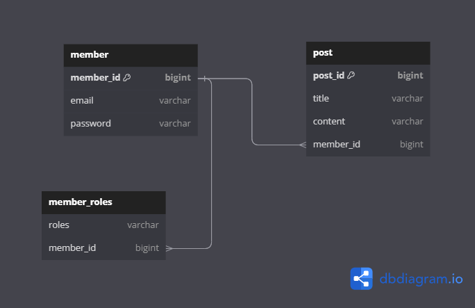

# wanted-pre-onboarding-backend
원티드 프리온보딩 사전과제

# 지원자의 성명
조국선

# 애플리케이션의 실행 방법 (엔드포인트 호출 방법 포함)
1. 먼저 Docker가 설치되어 있는지 확인. Docker가 설치되어 있지 않다면 Docker를 설치.
2. 터미널 또는 명령 프롬프트에서 다음 명령어를 실행하여 해당 GitHub 레포지토리의 코드를 클론:
```bash
git clone https://github.com/JoeGukseon/wanted-pre-onboarding-backend.git
```
3. 클론한 디렉토리로 이동:
```bash
cd wanted-pre-onboarding-backend
```
4. Docker Compose를 사용하여 애플리케이션을 빌드하고 실행:
```bash
docker-compose up -d
```
5. 애플리케이션을 종료하려면 다음 명령어를 사용
```bash
docker-compose down
```

# 데이터베이스 테이블 구조
https://dbdiagram.io/d/64c8898302bd1c4a5e058bdd


# 구현한 API의 동작을 촬영한 데모 영상 링크
[프리온보딩_인턴쉽_데모영상](https://drive.google.com/file/d/1oF7HLZZhbmJHZ24lEE-xNfrcXNkDEufr/view?usp=drive_link)

# 구현 방법 및 이유에 대한 간략한 설명
1. 사용자 회원가입 엔드포인트
- 컨트롤러로 엔드포인트를 구현 하고, DTO에 유효성을 활용하여
- 표현식으로 '@' 조건, 비밀번호 8자 이상 구현 (다른 유효성X)
- DB저장시 passwordEncoder로 암호화 하여 저장

2. 사용자 로그인 엔드포인트
- 스프링 시큐리티를 활용하여 이메일, 비밀번호를 검증(이부분도 필터에 유효성검사를 넣어 우선적 확인)
- 인증이 성공하면 권한 부여 하고 JWT에 사용자 아이디, 이메일, 권한을 넣어 발행 하여 리스폰 헤더로 전송

3. 새로운 게시글을 생성하는 엔드포인트
- 게시글 작성시 제목과 내용을 받아 컨트롤러에서 게시글을 만들어 DB에 저장 게시글에 외부키는 
- JWT안에 사용자아이디를 받아 적용, JWT를 넣어(로그인) 주지 않으면 인증 예외처리

4. 게시글 목록을 조회하는 엔드포인트
- 페이지네이션의 조건을 Query Parameter로 받아 게시글 페이지네이션 처리
- 로그인 조건없이 처리

5. 특정 게시글을 조회하는 엔드포인트
- PathVariable로 게시글 번호를 받아 게시글번호의 게시글을 리턴
- 로그인 조건없이 처리

6. 특정 게시글을 수정하는 엔드포인트
- PathVariable로 게시글 번호, Body로 수정내용을 받아 게시글 수정처리
- 로그인 하여 JWT를 헤더에 넣어보내주면 JWT에 있는 사용자아이디를 받아 작성자만 수정가능(나머지 예외처리)

7. 특정 게시글을 삭제하는 엔드포인트
- PathVariable로 게시글 번호를 받아 게시글을 삭제처리
- 로그인 하여 JWT를 헤더에 넣어보내주면 JWT에 있는 사용자아이디를 받아 작성자만 삭제가능(나머지 예외처리)

8. docker compose를 이용하여 애플리케이션 배포
- 서버 도커 이미지로 생성하여 
- DB, 서버이미지를 도커 컴포즈로 구성하여 배포(서버 정상 부팅을 위해 안정적 딜레이(20초)를 걸어 순차 실행)


# API 명세(request/response 포함)
https://documenter.getpostman.com/view/24687308/2s9Xxwxugv